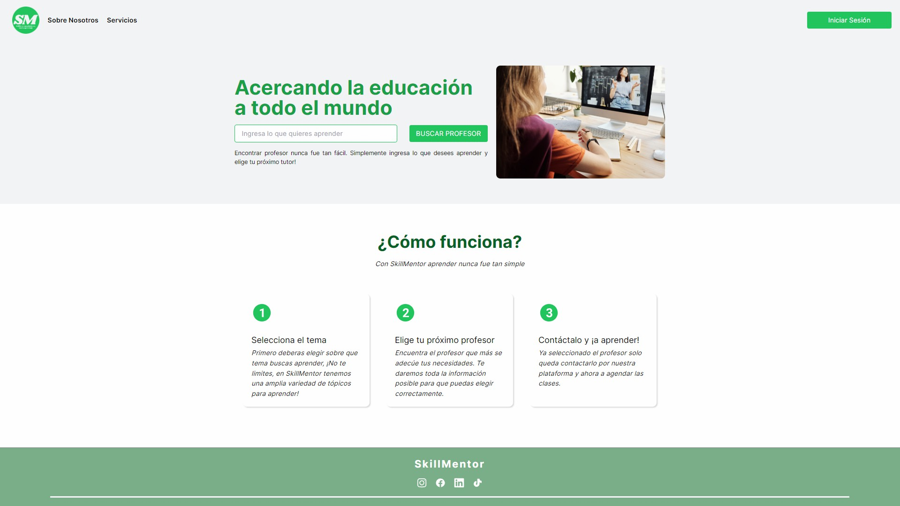

#  SkillMentor - BackEnd API



### Introducción

Proyecto de BackEnd de SkillMentor. Debe utilizarse en conjunto con https://github.com/lucashmunoz/tpo-apis-g02-front

### Instalación

- Clonar el repositorio:
  ```bash
  git clone https://github.com/lucashmunoz/tpo-apis-g02-back.git
  ```
- Dirigirse al directorio tpo-apis-g02-back

  ```bash
  cd tpo-apis-g02-back
  ```

- Instalar dependencias

  ```bash
  npm install
  ```

### Iniciando el proyecto

Para correr el proyecto se debe ejecuar el siguiente comando:

```bash
npm start
```

## 🔌Stack tecnológico utilizado en el proyecto

Esta es la lista de las principales dependencias y sus versiones utilizadas:

- cloudinary@1.41.0
- expres@4.16.0,
- jsonwebtoken@8.3.0
- mongoose@5.2.3,
- nodemailer@6.9.7,
- nodemon@1.19.4,
- eslint@8.53.0,
- prettier@3.0.3,
